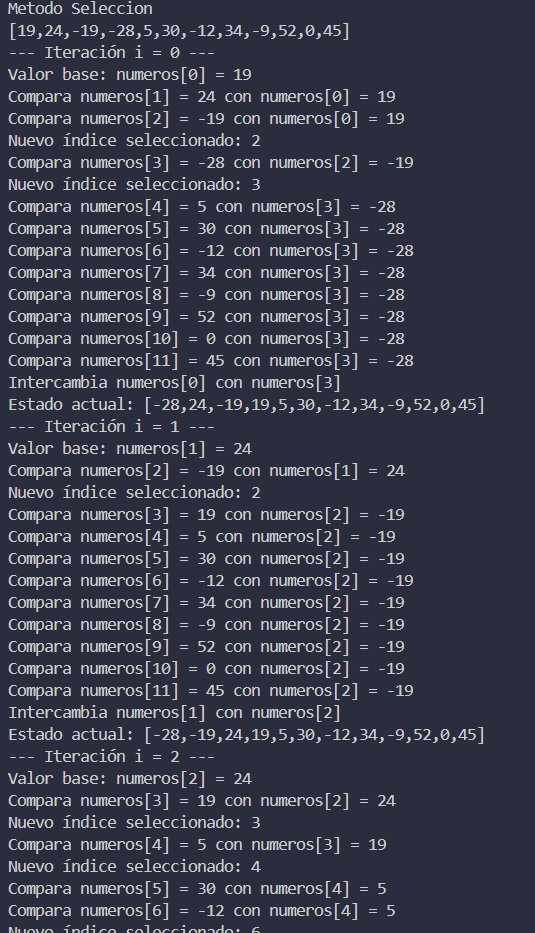
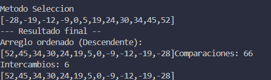
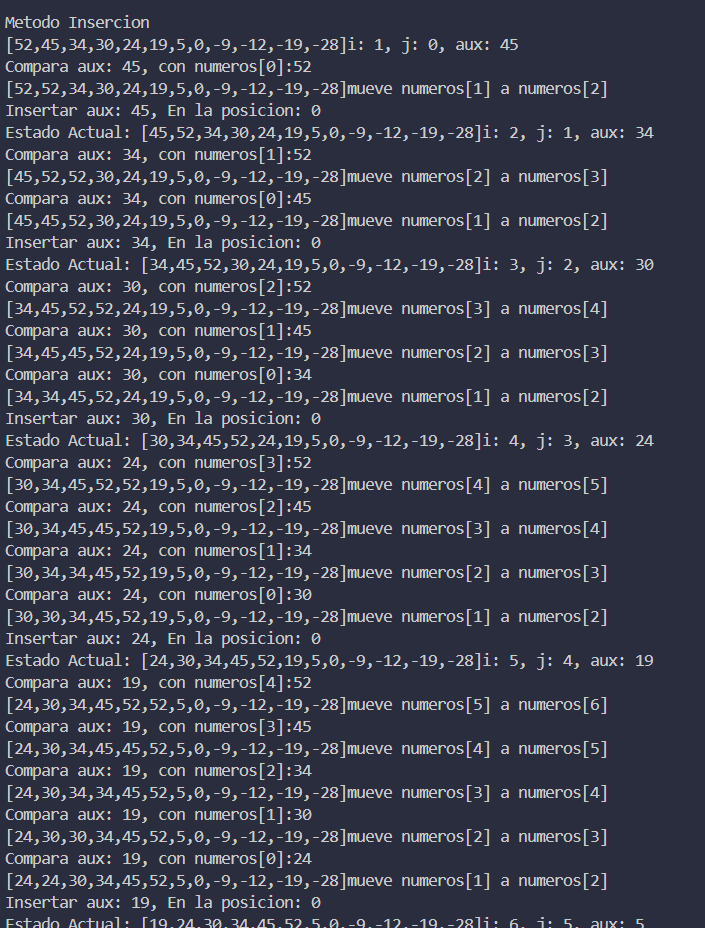
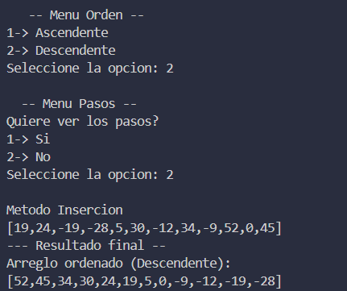
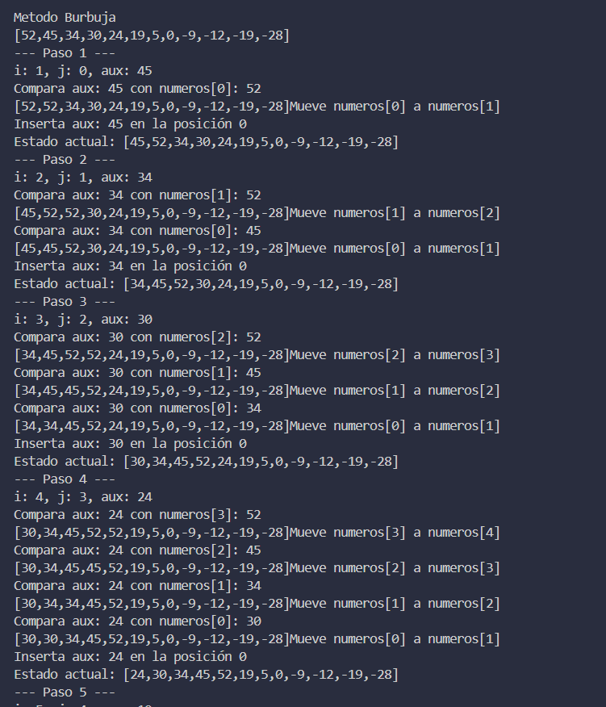

# Estructura de datos

**Estudiante:** Pedro Panjón

## Metodos de Ordenamiento

### SORT SELECTION

    1. Metodo Sort Selection Ascendente CON pasos

    2. Metodo Sort Selection Descendente SIN pasos

### SORT INSERCION

    1. Metodo Sort insercion Ascendente CON pasos

    
    2. Metodo Sort insercion Descendente SIN pasos

### SORT BUBBLE MEJORADO 

    1. Metodo Sort Bubble Ascendente CON pasos

    2. Metodo Sort Bubble Descendente SIN pasos
 